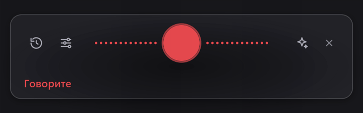

<div align="center">

**[🇷🇺 Русский](README.md)** · 🇬🇧 English


# PasteTalk

**Push-to-talk dictation. Local, no internet required.**

Press a hotkey → speak → press again → the text is in your clipboard.
Recognition runs on your own machine: neither audio nor text ever leaves it.
Away from your desk? A phone app and a Telegram bot work through your own self-hosted server.

> **Note:** the user interface is currently Russian-only. Everything else — the engine, the server, the code — is language-agnostic, and Whisper recognizes dozens of languages out of the box.

[](https://github.com/DanT2000/PasteTalk/releases/latest)

[](https://github.com/DanT2000/PasteTalk/releases/latest)
[](https://github.com/DanT2000/PasteTalk/releases)
[](LICENSE)
[](#)
[](https://github.com/DanT2000/PasteTalk/stargazers)

<br>



<sub>Press the hotkey → speak → the text is already in your clipboard.</sub>

</div>

## What it does

- **Recognition on your own hardware** — [faster-whisper](https://github.com/SYSTRAN/faster-whisper) on CUDA or CPU. Five models from Tiny to Large-v3, switchable in settings.
- **Text doesn't wait for you to finish** — speech is segmented by pauses, so while you speak the next sentence, the previous one is already being transcribed. When you release the hotkey, only the last phrase is left to process.
- **The model doesn't sit in VRAM forever** — after a configurable idle period it unloads, and wakes on the next hotkey press (~3.7 s for Large-v3 on CUDA — done before you finish your first sentence).
- **Optional AI cleanup** — a language model removes filler words and fixes punctuation, or rewrites spoken rambling into business-style text. Works with LM Studio, Ollama, CLI agents (Claude Code, Codex), or any OpenAI-compatible API. Disabled by default.
- **File transcription** — video and audio files, with or without timestamps.
- **Phone app and Telegram bot** — through your own self-hosted server ([server/](server/), Docker). The server offers each job to your home PC first and only falls back to a cloud API if the PC is offline — or never, if you leave the cloud chain empty. A built-in admin panel tracks minutes recognized for free on your own hardware versus cloud spend.
- **Resilient recording** — noise-gated microphones that output digital zeros, quiet voices, devices grabbed by games mid-recording: whatever was said gets transcribed rather than silently dropped.
- **Self-updating** — one click inside the app downloads, installs and restarts. Nothing happens without your consent.
- **UI scales to 100 / 125 / 150 %** — the whole interface, including the recording panel. Built for people who find small print hard to read.

## Privacy

Nothing goes online except a one-time model download from Hugging Face. Recognition is fully local; recordings and transcripts are never stored or sent anywhere. The only exception is optional AI cleanup through a cloud provider — if you explicitly configure one. API keys live only on your machine.

## Install

1. Download **`PasteTalk-x.y.z-Setup.exe`** from the [latest release](https://github.com/DanT2000/PasteTalk/releases/latest).
2. Run it. SmartScreen will warn you because the installer isn't signed with a paid certificate — click **More info → Run anyway** (or verify the SHA-256 from the release notes, or build from source below).
3. On first launch the app asks for a model and a microphone, then downloads the model once (Large-v3 is ~3 GB). No internet needed afterwards.

The Android APK ships in the same release. The server deploys with Docker — see [server/](server/) and [API docs](server/API.md).

## Build from source

Requires [Node.js 20+](https://nodejs.org/) and [uv](https://docs.astral.sh/uv/) (no system Python needed):

```powershell
git clone https://github.com/DanT2000/PasteTalk.git
cd PasteTalk
npm install
npm run engine:setup     # Python 3.12 + faster-whisper into engine/.venv
npm start                # run
npm run build            # release/PasteTalk-x.y.z-Setup.exe
```

## How it's put together

```
app/main/       Electron main process: tray, hotkeys, clipboard, watchdog
app/renderer/   windows: settings, recording panel, hidden audio capture
engine/         Python recognition engine — a separate process
server/         self-hosted server: phone, Telegram bot, admin panel (Node + SQLite)
android/        phone app (Kotlin + Compose, zero third-party deps)
shared/         prompts and provider presets shared by desktop and server
```

The engine is a separate process on purpose: a CUDA crash can't take down the UI. They talk over HTTP on a random localhost port with a per-launch token; when the app exits, the engine notices the closed stdin and follows.

## License

[MIT](LICENSE) — use it anywhere, including commercially. Keep the attribution.

Built on [faster-whisper](https://github.com/SYSTRAN/faster-whisper), [CTranslate2](https://github.com/OpenNMT/CTranslate2), [Whisper](https://github.com/openai/whisper) and [Electron](https://www.electronjs.org/) — all MIT.

---

<div align="center">

**Found it useful?** Star the repo ⭐ — that's how other people discover it.

</div>
