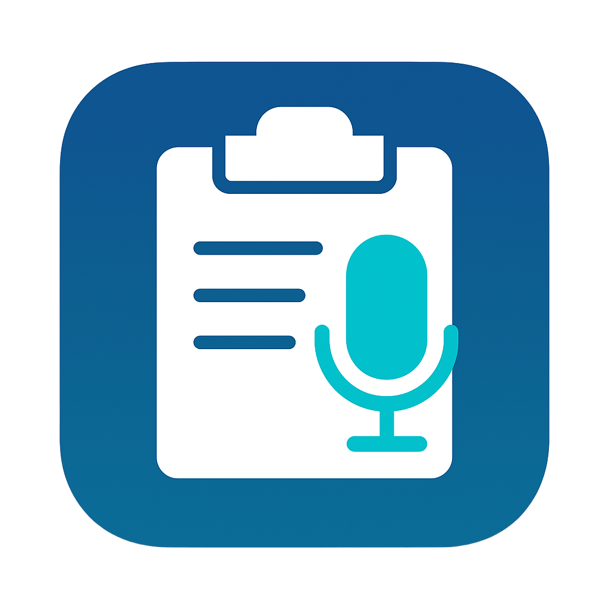

<p align="center">
  
</p>
## 🧭 Навигация

- 🇷🇺 [Русская версия](#-pastetalk--голос-в-текст-через-telegram-с-поддержкой-гигачата)
- 🇬🇧 [English version](#pastetalkGB)

---

<a name="-pastetalk--голос-в-текст-через-telegram-с-поддержкой-гигачата"></a>

## 🇷🇺 PasteTalk — голос в текст через Telegram (с поддержкой Гигачата)

**PasteTalk** — это десктопное приложение для Windows, которое позволяет:

- 🔴 записывать голос по горячим клавишам
- 📤 отправлять его в Telegram-чат с ботом (например, [Гигачат от Сбера](https://sber.ru/gigachat))
- ✍️ получать расшифрованный текст
- 📋 автоматически копировать текст в буфер обмена

Идеально для быстрых заметок, диктовки мыслей, команд или создания текста голосом.

---

## 📦 Что потребуется

- Python 3.10+ (⚠️ Python 3.13 официально не поддерживается Telethon но работает)
- [FFmpeg](https://ffmpeg.org/download.html) (для конвертации `.wav` → `.ogg`)
- Аккаунт Telegram
- Чат с активированным ботом (например, Гигачат от Сбера)

---

## 💾 Установка

```bash
git clone https://github.com/DanT2000/PasteTalk.git
cd PasteTalk
python -m venv .venv
.venv\\Scripts\\activate  # для Windows
pip install -r requirements.txt
```

---

## ⚙️ Настройка `config.json`

Файл `config.json` находится рядом с `main.py`. Пример:

```json
{
  "api_id": 123456,
  "api_hash": "your_api_hash_here",
  "target_chat_name": "Голосовой буфер",
  "giga_username": "gigachat_sberbot",
  "clipboard_enabled": true,
  "min_text_length": 5,
  "log_messages": true,

  "indicator_width": 60,
  "indicator_height": 30,
  "indicator_position": "top-right",
  "indicator_margin": 20
}
```

### 📘 Пояснения:

| Поле                   | Описание |
|------------------------|----------|
| `api_id`, `api_hash`   | Получаются на [my.telegram.org](https://my.telegram.org/auth) (обязательна авторизация) |
| `target_chat_name`     | Часть названия чата, где находится бот (например, `Голосовой буфер`) |
| `giga_username`        | Username бота, например `gigachat_sberbot` (без @) |
| `clipboard_enabled`    | Автоматически копировать текст в буфер обмена |
| `min_text_length`      | Минимальная длина текста, чтобы он был скопирован |
| `log_messages`         | Показывать ли ответы бота в консоли |
| `indicator_position`   | Позиция индикатора: `top-left`, `top-right`, `bottom-left`, `bottom-right` |
| `indicator_margin`     | Отступ от выбранного угла экрана (в пикселях) |
| `indicator_width/height` | Размер прямоугольника-индикатора |
| `hotkeys` | Горячие клавиши |

---

## 🔐 Вход в Telegram

При первом запуске скрипт попросит ввести **номер телефона** Telegram. Также может запросить **код из Telegram** и **пароль** (если включена двухфакторка).

⚠️ **Рекомендуется использовать отдельный аккаунт Telegram**, если вы не доверяете сторонним скриптам авторизации или просто хотите разделить личную и рабочую активность.

---

## 🚀 Как пользоваться

1. Запустите приложение:
```bash
python main.py
```

2. Нажмите **Ctrl + Win** — начнётся запись голоса  
3. Нажмите **ещё раз Ctrl + Win** — запись остановится и отправится в чат  
4. Ответ от бота скопируется в буфер обмена (если это разрешено)

---

### 🗣 Использование Гигачата как голосового ассистента

Если начать своё сообщение с фразы **«Гигачат...»**, а затем произнести команду или вопрос, бот воспримет это как **обращение** и отреагирует как **голосовой помощник**:

> 🧠 Пример:  
> _«Гигачат, какие сегодня новости?»_  
> — бот сначала распознает вашу речь, а затем через пару секунд пришлёт полноценный ответ.

Это позволяет использовать PasteTalk как **персонального голосового ассистента**, работающего через Telegram + Гигачат.


---

## 🎨 Поведение цветного индикатора

На экране появляется прямоугольник-индикатор (цвет, размер и позиция задаются в конфиге):

| Цвет       | Состояние                  |
|------------|----------------------------|
| 🔴 Красный | Идёт запись                |
| 🟡 Жёлтый  | Обработка и отправка       |
| 🟢 Зелёный | Успешный ответ от бота     |
| 🔵 Синий   | Ошибка (нет ответа, сбой)  |

🧼 Индикатор автоматически исчезает через 1 секунду после завершения.

---

## ❓ Проблемы и решения

- **Ничего не записывается** → Убедитесь, что микрофон выбран по умолчанию в системе
- **ffmpeg не найден** → Установите [ffmpeg](https://ffmpeg.org/download.html) и добавьте его в `PATH`
- **Ошибка авторизации** → Убедитесь, что ввели правильный номер телефона и код
- **Сообщения не отправляются** → Проверьте `target_chat_name` и `giga_username`
- **Индикатор не видно** → Настройте `indicator_position` и `indicator_margin` под ваш монитор

---

## 💡 Рекомендации

- Используйте **отдельный аккаунт Telegram**, чтобы не бояться авторизации
- Настраивайте индикатор под свою конфигурацию мониторов
- Подключите `gigachat_sberbot` к нужному чату и убедитесь, что он распознаёт голос

---

## 📌 В будущем:

- [ ] Сборка `.exe` (для запуска без Python)
- [ ] Поддержка других ИИ-ботов (YandexGPT, GigaChat API напрямую и т.д.)
- [ ] История сообщений и лог-файл
- [ ] Поддержка микрофона по выбору

---

## 👤 Автор

Разработано с душой: **BlackDev**  


---


---
<a name="pastetalkGB"></a>
## 🇬🇧 PasteTalk — Voice to Text via Telegram (with GigaChat support)

**PasteTalk** is a desktop voice-to-text utility for Windows. It lets you:

- 🔴 Record voice using a hotkey
- 📤 Send it to a Telegram chat with a bot (e.g., [GigaChat by Sberbank](https://sber.ru/gigachat))
- ✍️ Receive transcribed text from the bot
- 📋 Automatically copy the result to your clipboard

Perfect for quick notes, voice commands, idea dumps or productivity workflows.

---

### 📦 Requirements

- Python 3.10+ (⚠️ Python 3.13 is not officially supported by Telethon but might still work)
- [FFmpeg](https://ffmpeg.org/download.html) — must be installed and in your system `PATH`
- Telegram account
- Chat with an active bot (GigaChat works well)

---

### 💾 Installation

```bash
git clone https://github.com/DanT2000/PasteTalk.git
cd PasteTalk
python -m venv .venv
.venv\\Scripts\\activate  # On Windows
pip install -r requirements.txt
```

---

### ⚙️ Configuring `config.json`

Located next to `main.py`. Example:

```json
{
  "api_id": 123456,
  "api_hash": "your_api_hash_here",
  "target_chat_name": "Voice Buffer",
  "giga_username": "gigachat_sberbot",
  "clipboard_enabled": true,
  "min_text_length": 5,
  "log_messages": true,

  "indicator_width": 60,
  "indicator_height": 30,
  "indicator_position": "top-right",
  "indicator_margin": 20
}
```

| Field              | Description                                                                 |
|-------------------|-----------------------------------------------------------------------------|
| `api_id`, `api_hash`  | Get from [my.telegram.org](https://my.telegram.org)                        |
| `target_chat_name` | Part of the chat title where the bot is located                            |
| `giga_username`    | Bot's username, e.g., `gigachat_sberbot`                                   |
| `clipboard_enabled`| Whether to auto-copy bot response to clipboard                             |
| `min_text_length`  | Minimum text length to trigger clipboard copy                              |
| `log_messages`     | Whether to print GigaChat responses in console                             |
| `indicator_position`| Position: `top-left`, `top-right`, `bottom-left`, `bottom-right`           |
| `indicator_margin` | Margin from screen edge (pixels)                                           |
| `indicator_width`, `indicator_height` | Indicator rectangle size                                |
| `hotkeys` | Hot keys |

---

### 🔐 Telegram Login

On first launch, you’ll be asked to enter your **phone number**, **login code** from Telegram, and (if enabled) your **2FA password**.

⚠️ It's recommended to use a **separate Telegram account** for this app, especially if you value your main account’s security or privacy.

---

### 🚀 How to Use

1. Launch the app:
```bash
python main.py
```

2. Press **Ctrl + Win** → recording starts  
3. Press **Ctrl + Win** again → recording stops & message is sent  
4. Bot’s reply (if any) will be copied to clipboard automatically

---

### 🗣 GigaChat as a voice assistant

If you start your voice message with **“GigaChat...”**, the bot will interpret it as a direct request and act like a voice assistant.

> 💬 Example:  
> _“GigaChat, what’s the news today?”_  
> → Bot will transcribe your voice, then reply with an actual answer.

That allows you to use PasteTalk as a **speech-controlled AI assistant** via Telegram.

---

### 🎨 Indicator Behavior

A colored rectangle will appear on screen during use:

| Color     | Meaning                  |
|-----------|--------------------------|
| 🔴 Red    | Recording                |
| 🟡 Yellow | Sending / Waiting        |
| 🟢 Green  | Success / Bot responded  |
| 🔵 Blue   | Error / No response      |

The indicator disappears automatically after 1 second.

---

### ❓ Troubleshooting

- **No audio recorded?** → Make sure your default mic is active in system settings  
- **No `ffmpeg`?** → Install it and ensure it’s in the system `PATH`  
- **No response from bot?** → Check `target_chat_name` and `giga_username`  
- **Indicator not showing?** → Tweak `indicator_position` and `indicator_margin`  
- **Wrong text copied?** → Check `min_text_length` setting

---

### 💡 Tips

- Use a **separate Telegram account** to avoid authorization risks
- Customize the indicator rectangle to suit your screen setup
- Make sure the bot (e.g., GigaChat) is invited to the target chat and works with voice messages

---

### 📌 Planned Features

- [ ] EXE packaging via PyInstaller  
- [ ] Support for other AI bots / APIs  
- [ ] History log of voice-to-text interactions  
- [ ] Microphone selection support  

---

### 👤 Author

Created by **BlackDev** with ❤️  
PRs and feedback welcome!

