<div align="center">


# PasteTalk

**Голос в текст по горячей клавише. Локально, без интернета.**

Нажали → сказали → нажали ещё раз → текст в буфере обмена.
Распознавание идёт на вашем компьютере: ни звук, ни текст никуда не уходят.
А когда вы не за компьютером — телефон и Telegram-бот через ваш собственный сервер.

<sub>*Push-to-talk dictation for Windows: local Whisper, nothing leaves your machine. Phone app and Telegram bot via your own self-hosted server. Russian-first UI.*</sub>

[](https://github.com/DanT2000/PasteTalk/releases/latest)

[](https://github.com/DanT2000/PasteTalk/releases/latest)
[](https://github.com/DanT2000/PasteTalk/releases)
[](LICENSE)
[](#)
[](https://github.com/DanT2000/PasteTalk/stargazers)

</div>

<br>

<div align="center">

### Панель записи

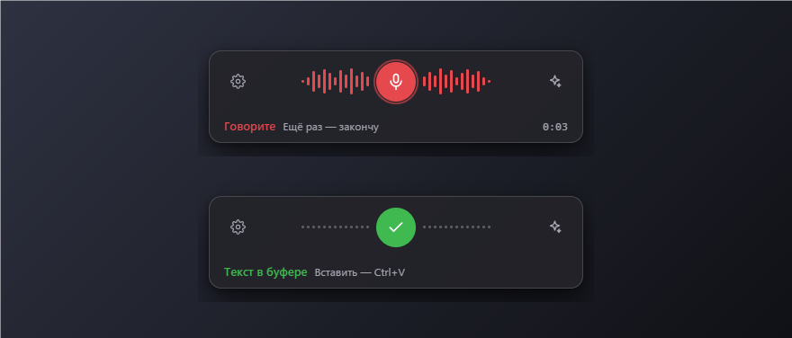

<sub>Небольшое окно внизу экрана поверх остальных. Полоски живут по вашему голосу: молчите — ниточка, говорите — столбики.<br>Слева настройки, в центре микрофон, справа улучшение текста.</sub>

</div>

<br>

<div align="center">

### Настройки

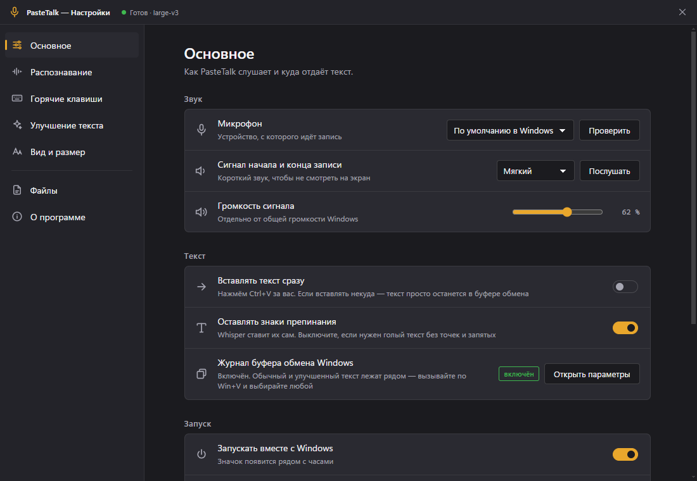

<sub>Всё написано человеческим языком: что делает переключатель и что будет, если его тронуть.</sub>

</div>

<br>

<table>
<tr>
<td width="50%" valign="top" align="center">

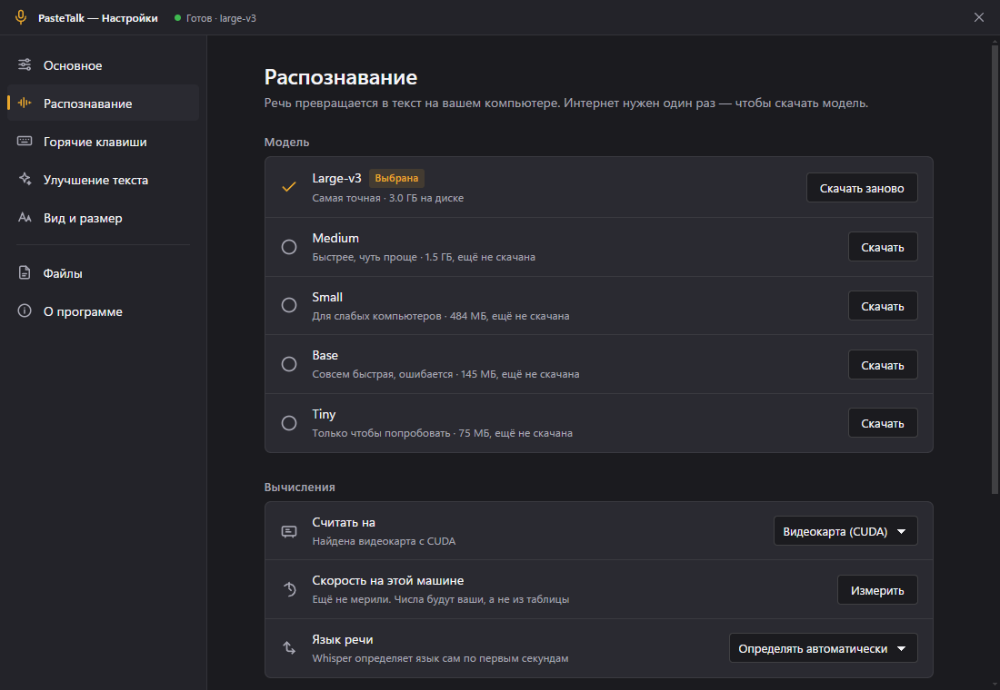

**Распознавание**<br>
<sub>Пять моделей на выбор, видно размер и что уже скачано. Считать можно на видеокарте или на процессоре.</sub>

</td>
<td width="50%" valign="top" align="center">

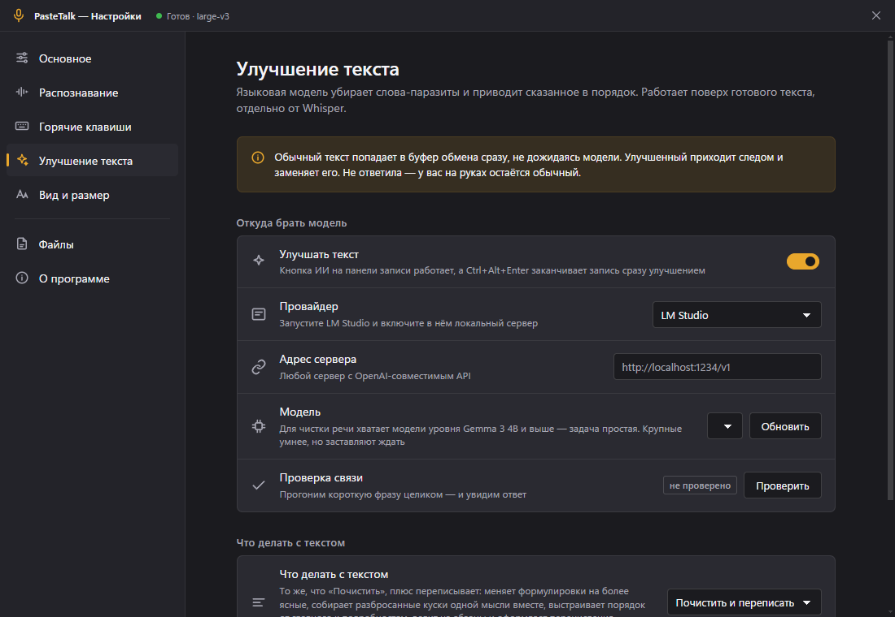

**Улучшение текста**<br>
<sub>LM Studio, Ollama, Claude Code, Codex, ChatGPT, DeepSeek — или свой сервер. У агентов ещё и выбор модели.</sub>

</td>
</tr>
<tr>
<td width="50%" valign="top" align="center">

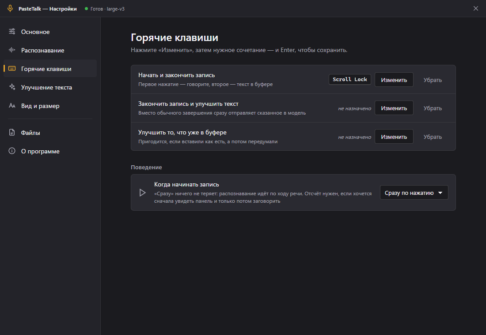

**Горячие клавиши**<br>
<sub>Нажали «Изменить», нужное сочетание и Enter. Занятое другой программой не даст сохранить.</sub>

</td>
<td width="50%" valign="top" align="center">

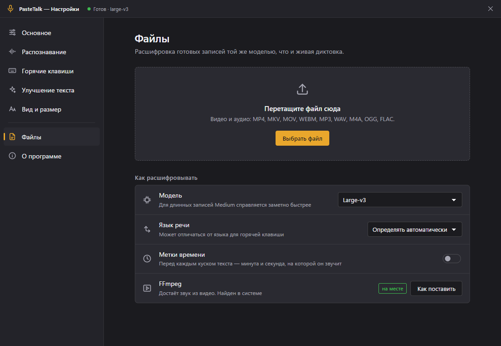

**Файлы**<br>
<sub>Видео и аудио, с метками времени или без. Модель можно взять другую, чем для диктовки.</sub>

</td>
</tr>
</table>

<br>

<div align="center">

### Размер интерфейса — 100 / 125 / 150 %

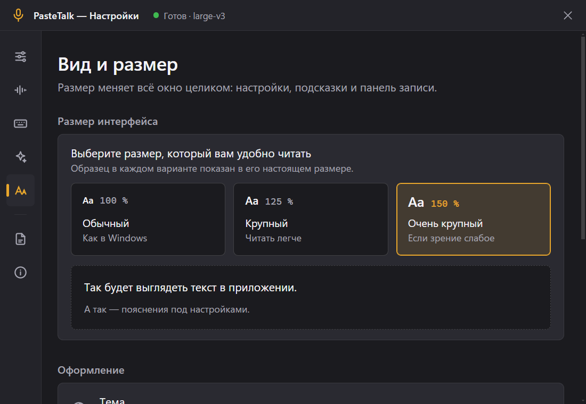

<sub>Меняется всё окно целиком, включая панель записи. Образец в каждом варианте показан в его настоящем размере,<br>поэтому выбрать можно глазами, не применяя настройку. На снимке — 150 %.</sub>

</div>

<br>

<div align="center">

### Светлая тема

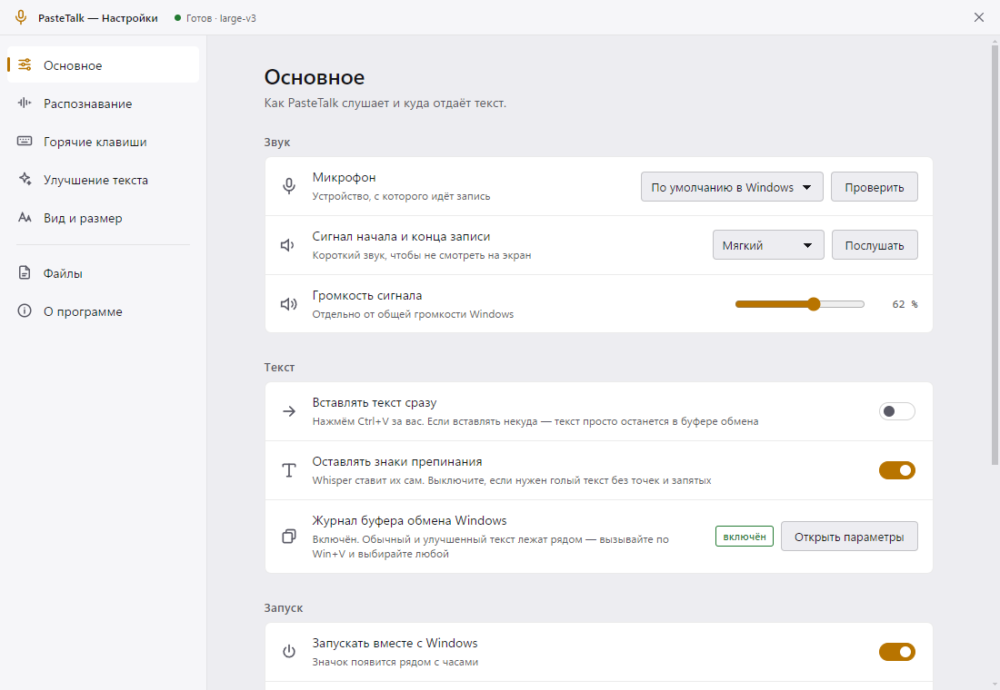

<sub>Или «Как в Windows» — переключается вместе с системной.</sub>

</div>

<br>

<div align="center">

### С телефона и из Telegram

<table>
<tr>
<td align="center">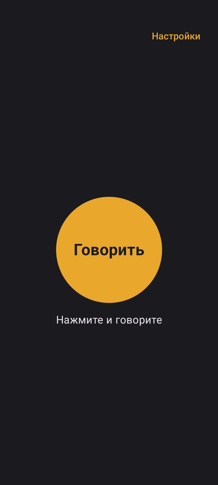</td>
<td align="center">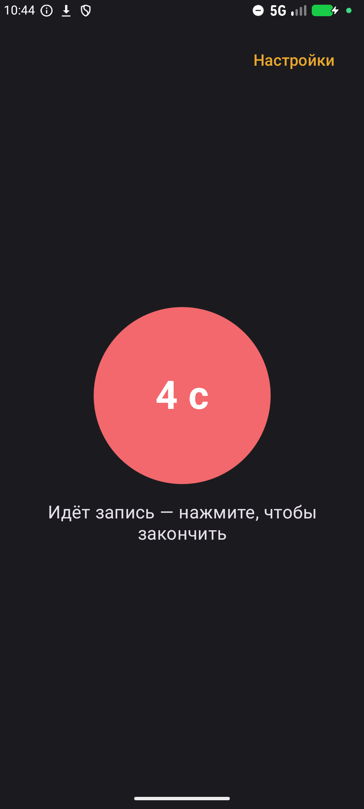</td>
</tr>
</table>

<sub>Одна большая кнопка и крупный шрифт. Голос уходит на <b>ваш</b> сервер, распознаётся вашим же компьютером<br>(или облаком, если он выключен) — и возвращается текстом, уже скопированным в буфер.</sub>

<br><br>

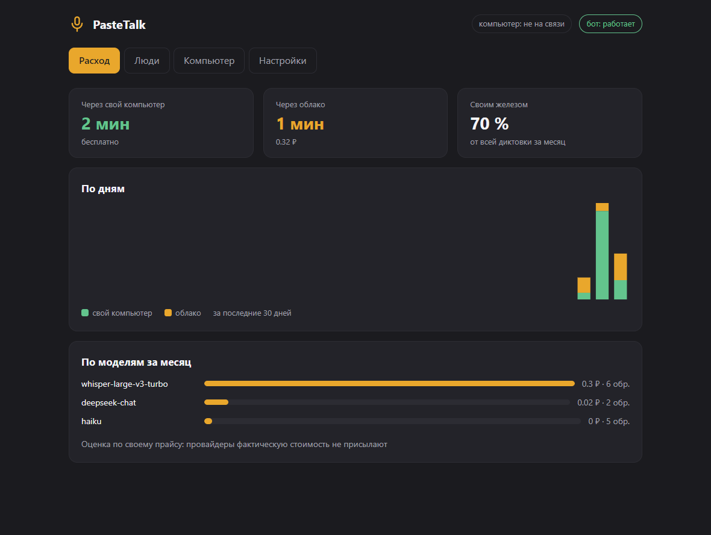

<sub>У сервера есть админка: сколько минут распозналось бесплатно на своём железе, сколько ушло в облако и почём,<br>люди и коды доступа, промпты улучшения — всё правится в браузере. Тут же живёт Telegram-бот:<br>прислали голосовое — вернулся текст с кнопками «Почистить» и «Почистить и переписать».</sub>

</div>

---

## 📥 Установка

1. Скачайте **`PasteTalk-x.y.z-Setup.exe`** со [страницы релизов](https://github.com/DanT2000/PasteTalk/releases/latest).
2. Запустите. Windows покажет синее окно «SmartScreen защитил ваш компьютер» — это потому, что установщик не подписан платным сертификатом, а не потому, что с ним что-то не так. Нажмите **«Подробнее» → «Выполнить в любом случае»**.
3. Выберите папку, поставьте галочку ярлыка на рабочем столе — и всё.
4. При первом запуске программа спросит модель и микрофон и скачает модель. Это разово: **Large-v3 весит 3 ГБ**, дальше интернет не нужен.

Значок появится **рядом с часами** — там же настройки, пауза и выход.

---

## 🎙 Как этим пользоваться

| | |
|---|---|
| **Начать и закончить запись** | `Ctrl` + `Alt` + `Space` |
| **Закончить и сразу улучшить текст** | `Ctrl` + `Alt` + `Enter` |
| **Улучшить то, что уже в буфере** | `Ctrl` + `Alt` + `I` |

Сочетания меняются в настройках — нажмите «Изменить», нужные клавиши и `Enter`.

Внизу экрана появляется небольшая панель поверх всех окон: слева настройки, в центре микрофон, справа кнопка ИИ. Полоски по бокам показывают настоящую громкость — молчите, ниточка; говорите, столбики.

**Текст не ждёт конца речи.** Запись режется по паузам: закончили фразу — она уже ушла в модель, пока вы говорите дальше.

---

## ✨ Что умеет

- **Распознавание на своём железе** — [faster-whisper](https://github.com/SYSTRAN/faster-whisper) на видеокарте (CUDA) или процессоре. Пять моделей от Tiny до Large-v3, переключаются в настройках.
- **Текст сразу в дело** — ложится в буфер обмена и, если попросить, вставляется сам нажатием `Ctrl`+`V`.
- **Улучшение текста** — языковая модель убирает слова-паразиты и приводит сказанное в порядок. Обычный текст при этом уже у вас: улучшенный приходит следом и заменяет его, а если модель не ответила — терять нечего.
- **Расшифровка файлов** — видео и аудио, с метками времени или без. Модель для файлов можно взять другую, чем для диктовки.
- **Размер интерфейса 100 / 125 / 150 %** — всё окно целиком, включая панель записи. Сделано для тех, кому мелкий шрифт читать тяжело.
- **Несколько мониторов** — панель записи можно закрепить за выбранным экраном, а не гоняться за курсором.
- **Бережно к диктовке** — микрофон с шумодавом, тихий голос, устройство забрала игра: наговорённое всё равно распознаётся, а не выбрасывается. Умер микрофон посреди записи — панель скажет об этом прямо во время диктовки.
- **Защита от случайного нажатия** — если вы так ничего и не сказали, запись отменяется молча и в буфер ничего не кладётся.
- **Присмотр за собой** — движок распознавания перезапускается сам, до десяти раз за полчаса; если и это не помогло, программа скажет об этом, а не промолчит. Ошибки за сутки собраны отдельным списком, повторы свёрнуты в одну строку со счётчиком.
- **Обновление в один клик** — программа спросит, скачает, тихо поставит и перезапустится. Без походов по сайтам, и ничего — без вашего согласия.
- **Телефон и Telegram** — приложение для Android (в каждом выпуске) и бот: голосовое → текст → кнопки улучшения. Работают через ваш собственный сервер ([server/](server/), разворачивается в Docker), который сначала спрашивает ваш компьютер и только потом — облако.

---

## 🤖 Улучшение текста: откуда брать модель

Работает поверх готового текста и **выключено по умолчанию**. Любой вариант на выбор:

| Откуда | Ключ | Заметки |
|---|---|---|
| **LM Studio** | не нужен | Включите в нём локальный сервер. Для чистки речи хватает модели уровня Gemma 3 4B и выше — задача простая |
| **Ollama** | не нужен | `ollama pull` нужной модели |
| **Claude Code** | не нужен | Идёт через вашу подписку. Модель на выбор: Haiku `$`, Sonnet `$$`, Opus `$$$` |
| **Codex** | не нужен | Идёт через вашу подписку. Модель на выбор: `gpt-5.6-luna`, `terra`, `sol` |
| **ChatGPT, DeepSeek** | нужен | Обычный ключ OpenAI-совместимого API |
| **Своё** | по обстоятельствам | Любой сервер с `/v1/chat/completions` |

Модель полегче отвечает быстрее и стоит дешевле — для расстановки запятых самая мощная не нужна.

> **Про «думающие» модели.** Если модель умеет рассуждать, PasteTalk просит её этого не делать. Разница ощутимая: на очистке одной фразы Gemma 4 12B тратила 26 секунд и 694 токена рассуждений, а с выключенными — секунду и 17 токенов при том же результате.

---

## 🎬 Расшифровка файлов

Перетащите видео или аудио в раздел «Файлы». Поддерживаются MP4, MKV, MOV, WEBM, MP3, WAV, M4A, OGG, FLAC.

<a name="ffmpeg"></a>**Для видео нужен FFmpeg** — он достаёт звуковую дорожку. Программа проверяет его сама и пишет, найден он или нет. Поставить:

```powershell
winget install Gyan.FFmpeg
```

После установки перезапустите PasteTalk. Без FFmpeg читаются только аудиофайлы.

---

## 🔒 Что уходит в интернет

Ничего, кроме одной вещи: **при первом запуске скачивается модель** с Hugging Face. Дальше распознавание идёт полностью на вашем компьютере — записи и тексты никуда не отправляются и нигде не хранятся, кроме буфера обмена.

Единственное исключение — **улучшение текста через облачного провайдера** (ChatGPT, DeepSeek, платный шлюз). Тогда готовый текст уходит туда, куда вы его направили. С LM Studio, Ollama, Claude Code и Codex всё остаётся на машине или идёт через вашу личную подписку.

Ключи доступа лежат только у вас, в `%APPDATA%\pastetalk\settings.json`.

---

## 🛠 Собрать самому

Нужны [Node.js 20+](https://nodejs.org/) и [uv](https://docs.astral.sh/uv/) — Python устанавливать не надо, uv принесёт нужную версию сам и системный не тронет.

```powershell
winget install OpenJS.NodeJS.LTS
winget install astral-sh.uv

git clone https://github.com/DanT2000/PasteTalk.git
cd PasteTalk

npm install              # зависимости приложения
npm run engine:setup     # Python 3.12 + faster-whisper в engine/.venv
npm start                # запустить
```

Собрать установщик:

```powershell
powershell -ExecutionPolicy Bypass -File scripts/make-icon.ps1   # иконки
npm run engine:build                                             # движок в один exe
npm run build                                                    # release/PasteTalk-x.y.z-Setup.exe
```

### Как всё устроено

```
app/main/       основной процесс: трей, горячие клавиши, буфер обмена, присмотр
app/renderer/   окна: настройки, панель записи, скрытый захват звука
engine/         движок распознавания на Python — отдельный процесс
server/         свой сервер: телефон, Telegram-бот, админка (Node + SQLite, Docker)
android/        приложение для телефона (Kotlin + Compose, без зависимостей)
shared/         общее у компьютера и сервера: промпты улучшения, провайдеры
design/         макеты, с которых всё начиналось
```

Движок — отдельный процесс намеренно: упавшая модель не роняет интерфейс, а тяжёлая CUDA живёт своей жизнью. Общаются по HTTP на случайном порту localhost с одноразовым токеном; когда приложение закрывается, движок это замечает по закрытому stdin и уходит следом.

---

## 📄 Лицензия

[MIT](LICENSE) — берите, меняйте, используйте где угодно, в том числе в коммерческих проектах. Единственное условие: **сохраните указание авторства**.

Автор — [DanT2000](https://github.com/DanT2000).

Под капотом: [faster-whisper](https://github.com/SYSTRAN/faster-whisper) (MIT), [CTranslate2](https://github.com/OpenNMT/CTranslate2) (MIT), [Whisper](https://github.com/openai/whisper) от OpenAI (MIT), [Electron](https://www.electronjs.org/) (MIT).

---

<div align="center">

**Пригодилось?** Поставьте звезду ⭐ — по ним другие люди находят проект.

[](https://github.com/DanT2000/PasteTalk/stargazers)

</div>
